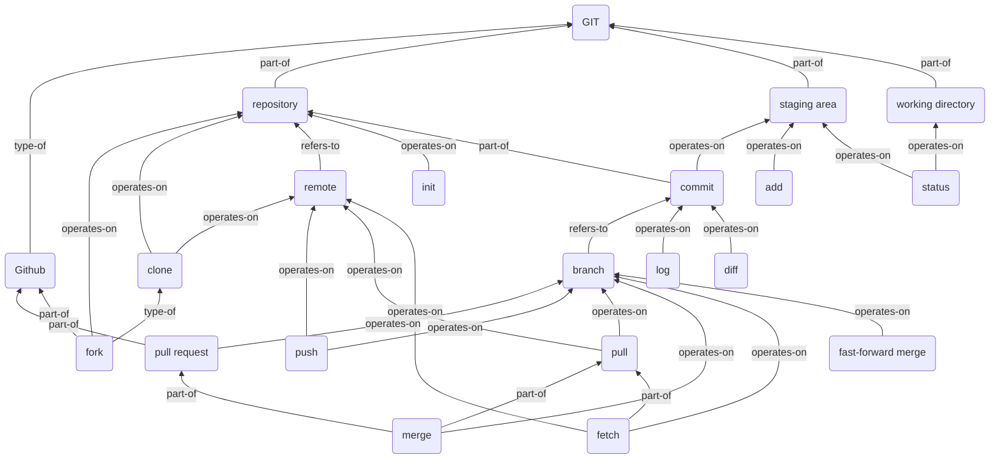

# Git Tips

*2019.7.1*

- [Git Tips](#git-tips)
  - [概念](#概念)
  - [working directory 工作区](#working-directory-工作区)
  - [staging area 暂存区](#staging-area-暂存区)
  - [repository 仓库](#repository-仓库)
    - [.git目录](#git目录)
    - [.gitignore文件](#gitignore文件)
  - [remote 远程仓库](#remote-远程仓库)
  - [branch 分支](#branch-分支)
    - [merge 合并](#merge-合并)
      - [普通合并](#普通合并)
      - [fast-forward merge 快进合并](#fast-forward-merge-快进合并)
    - [合并冲突](#合并冲突)
    - [删除分支](#删除分支)
    - [pull request 拉取请求（合并请求）](#pull-request-拉取请求合并请求)
  - [commit 提交](#commit-提交)
    - [提交间隔](#提交间隔)
    - [提交说明](#提交说明)
    - [更改提交](#更改提交)
      - [更改说明](#更改说明)
      - [向提交中添加忘记的文件](#向提交中添加忘记的文件)
      - [rebase 变基](#rebase-变基)
    - [SHA 提交ID](#sha-提交id)
    - [相关提交引用](#相关提交引用)
  - [常用命令](#常用命令)
  - [参考](#参考)

---

## 概念



---

## working directory 工作区

简单来说就是你在计算机的文件系统中看到的文件

---

## staging area 暂存区

对文件的更改都会放到暂存区，一次提交后暂存区反映为提交，暂存区清空

---

## repository 仓库

存放文件的地方，会对该文件夹下的所有文件进行追踪

### .git目录

- `config` 文件：存储了所有与项目有关的配置设置，git 会查看你当前所使用仓库对应的配置文件`.git/config`中的配置值。这些值仅适用于当前仓库
- `description` 文件：此文件仅用于 GitWeb 程序
- `hooks` 目录：我们会在此处放置客户端或服务器端脚本，以便用来连接到 Git 的不同生命周期事件
- `info` 目录：包含全局排除文件
- `objects` 目录：此目录将存储我们提交的所有提交
- `refs` 目录：此目录存储了指向提交的指针（通常是“分支”和“标签”）

### .gitignore文件

记录需要被git忽略的文件，可以对此文件进行文件管理

---

## remote 远程仓库

仓库的服务器端，会在本地留有副本，fetch命令可以更新

---

## branch 分支

一个版本的不同演化形成分支，`master`为主分支

分支会记录当前分支的父分支，log命令只会沿父分支进行展示，特定情况下会让部分提交无法访问，除非记录其ID

### merge 合并

#### 普通合并

原分支：两个分支的父分支分离位置的提交

对两个分支进行合并，合并时无冲突，对于某个更改的最终状态：

- 三个分支全部存在 --> 存在
- 三个分支全部不存在 --> 不存在
- 原分支与一个分支存在 --> 不存在，在一个分支中进行了删除，另一分支未改变，最后应该删除
- 仅一个分支存在 --> 存在，在一个分支中进行了增加，另一分支未改变，最后应该增加

合并分支后的结果为新建的一个提交，其父分支为合并的两个分支

#### fast-forward merge 快进合并

合并一个提交与他的父提交（包含更上一级的）时，不会新建提交，会将二者更新到最新的那个的状态

要合并的分支必须位于检出分支前面。检出分支的指针将向前移动，指向另一分支所指向的同一提交

### 合并冲突

```bash
<<<<<<< HEAD
//此行下方的所有内容（直到下个指示符）显示了当前分支上的行
||||||| merged common ancestors
//此行下方的所有内容（直到下个指示符）显示了原始行的内容
=======
//表示原始行内容的结束位置，之后的所有行（直到下个指示符）是被合并的当前分支上的行的内容
>>>>>>> heading-update
//是要被合并的分支（此例中是 heading-update 分支）上的行结束指示符
```

解决冲突后应将文件重新添加到暂存区。并进行提交

### 删除分支

删除的只是标签，提交并不会删除，但只能通过ID进行访问

可以手动回收垃圾，即清除这些提交

### pull request 拉取请求（合并请求）

向管理者发出申请，将自己的分支合并到master主分支中

可以用于更新自己fork的仓库，即请求将原有仓库的提交合并至自己fork的仓库中。此外，这个问题也可以将原作者的仓库作为本地仓库的远程仓库，从中拉取数据，合并后推送至fork仓库以更新

---

## commit 提交

基本操作，对仓库中所有文件创建新的版本

每次提交最好写明更改内容

每个提交有对应ID，使用时可以只输出前四个字符

### 提交间隔

选择合适的时间间隔进行提交：**为每项逻辑更改的更改进行一次提交**

例子：

- 已经花了一周时间来开发一项新功能，现在你提交添加这项新功能所需的所有更改。从你开始开发它以来，你一直没有进行提交。
  - 此提交似乎过大。如果每个提交只做了一项工作并且比较小，则理解每个提交所做的工作会变得更容易。在一周内不进行任何提交并非上策。
- 你在 README 中发现了三处打字错误。你改正并提交第一处错误。
  - 此提交似乎过小。改正所有三处打字错误后再一并提交会更好。这样一来，历史记录不会因打字错误的改正而变得过于混乱。此外，你无需担心会给 README 招致错误，因此，将更改捆绑在一起更可能会是一个好主意。
- 你已经花了一小时来开发一项新功能，现在，你提交添加这项新功能所需的所有更改。
  - 这可能是大小适中的提交。所有工作均与一项功能有关，因此，提交的逻辑目的很清晰。一小时后，可能累积了相当多的内容，但并未多到无法理解。
  - 另一方面，有时在工作了一小时后，你将会遇到一个以上的自然提交点，这时你会想将功能分解为多个较小的提交。因此，“过大”在这里也可能是一个合理的回答。
- 你改正了不同函数中的两个小错误，然后同时提交两者。
  - 此提交可能过大。在改正第一个错误后提交将会更好，因为这两个错误的改正互不相关。

**重点：每个提交都应具有一个清晰的逻辑目的，而且绝不应在不进行提交的情况下完成过多工作**

### 提交说明

**保持一致性!**

建议：

- 消息篇幅简短（少于 60 个字符）
- 解释提交的作用（不是如何更改或为何更改！）

禁忌：

- 请勿解释为何做出了这些更改
- 请勿解释如何进行了更改
- 请勿使用单词"and"
- 如果你必须使用 "and"，则你的提交说明可能进行了太多的更改，将这些更改拆分为独立的提交
- 例如 "make the background color pink and increase the size of the sidebar"

### 更改提交

#### 更改说明

`git commit --amend` 可直接更改提交说明

#### 向提交中添加忘记的文件

步骤：

1. 编辑文件
2. 保存文件
3. 暂存文件
4. 运行 `git commit --amend`

#### rebase 变基

`git rebase -i HEAD~?`  要操作几个提交，？处的数字就是几

对多个提交同时操作，可以用于合并多个提交

提交按从上到下更新排列

编辑指令：

- `pick`：使提交保持原样（缩写 `p`）
- `reword`：保留该提交，但我需要修改该提交的注释（缩写 `r`）
- `edit`：保留该提交, 但先不提交，以便修改（缩写 `e`）
- `squash`：将此提交的更改结合到之前的提交（列表中位于其上面的提交）（缩写 `s`）
- `fixup`： 将此提交的更改结合到前一个提交中，但删除提交说明（缩写 `f`）
- `exec`：执行shell命令（缩写 `x`）
- `drop`：删除提交（缩写 `d`）

### SHA 提交ID

SHA 是每个提交的ID编号，它是一个长40个字符的字符（由0–9和a–f组成），并根据 Git 中的文件或目录结构的内容计算得出。SHA 的全称是"Secure Hash Algorithm"（安全哈希算法）

### 相关提交引用

`^` 表示父提交

`~` 表示第一个父提交

我们可以通过以下方式引用之前的提交：

- 父提交，以下内容表示当前提交的父提交
  - `HEAD^`
  - `HEAD~`
  - `HEAD~1`
- 祖父提交，以下内容表示当前提交的祖父提交
  - `HEAD^^`
  - `HEAD~2`
- 曾祖父提交，以下内容表示当前提交的曾祖父提交
  - `HEAD^^^`
  - `HEAD~3`

`^` 和 `~` 的区别主要体现在通过合并而创建的提交中。合并的提交具有两个父级，`^` 引用用来表示第一个父提交，而 `^2` 表示第二个父提交。第一个父提交是当你运行 `git merge` 时所处的分支，而第二个父提交是被合并的分支。

例子：

```bash
* 9ec05ca (HEAD -> master) Revert "Set page heading to "Quests & Crusades""
* db7e87a Set page heading to "Quests & Crusades"
*   796ddb0 Merge branch 'heading-update'
|\  
| * 4c9749e (heading-update) Set page heading to "Crusade"
* | 0c5975a Set page heading to "Quest"
|/  
*   1a56a81 Merge branch 'sidebar'
|\  
| * f69811c (sidebar) Update sidebar with favorite movie
| * e6c65a6 Add new sidebar content
* | e014d91 (footer) Add links to social media
* | 209752a Improve site heading for SEO
* | 3772ab1 Set background color for page
|/  
* 5bfe5e7 Add starting HTML structure
* 6fa5f34 Add .gitignore file
* a879849 Add header to blog
* 94de470 Initial commit

因为HEAD 指向 9ec05ca commit：

HEAD^ 是 db7e87a commit
HEAD~1 是 db7e87a commit

HEAD^^ 是 796ddb0 commit
HEAD~2 是 796ddb0 commit

HEAD^^^ 是 0c5975a commit
HEAD~3 是 0c5975a commit

HEAD^^^2 是 4c9749e commit（这是曾祖父的 (HEAD^^) 第二个父 commit (^2))
```

---

## 常用命令

```bash
git config --list                  //显示设置信息
git log                            //查看日志，可以按q退出
git log --all                      //查看所有分支的日志
git log --stat                     //查看日志与更改量的统计数据，行为单位
git log --graph --oneline branchname1 branchname2 ...
//可视化并简洁显示分支情况
git log --patch                    //查看日志，显示文件的实际更改
git log -p                         //同上
git log -p -w                      //同上，并忽略空格更改
git log -p commit                  //同-p，从指定提交开始
git show commit                    //比较该提交与其父提交
git diff                           //比较工作区和暂存区
git diff --staged                  //比较暂存区和HEAD
git diff commit_old commit2_new    //比较两次提交，参数为提交ID
git --version                      //查看版本
git clone URL repositoryname       //克隆仓库
git config --global color.ui auto  //让文字有色彩
git tag                            //显示所有标签
git tag -d "message"               //删除标签
git tag "message"                  //加轻量级标签
git tag "message" commit           //给指定提交加标签
git tag -a "message"               //加带注释的标签
git checkout commit                //检出，即回滚至指定提交
git checkout branchname            //检出，即切换至指定分支
git checkout -b branchname         //新建分支并检出
git checkout -- file               //放弃工作区修改
git init                           //将当前目录初始化为仓库
git status                         //显示工作目录和暂存区的状态
git add filename1 filename2 ...    //添加文件到暂存区
git reset filename1 filename2 ...  //从暂存区删除文件
git reset --hard                   //清空暂存区
git reset commit                   //取消提交并清空暂存区，但工作区保留更改
git reset --soft commit            //取消提交并将提交退回至暂存区
git reset --hard commit            //取消提交，清除所有更改，包括工作区
git revert commit                  //还原提交
//此命令将通过创建一个新的提交来记录撤消目标提交，之前的保留
git commit -m "message"            //提交
git commit --amend                 //更改提交说明，详见上文
git branch                         //显示所有分支，*为当前状态
git branch branchname              //新建分支
git branch branchname commit       //创建分支并指向指定提交
git branch -d branchname           //删除分支
git gc                             //垃圾回收，慎用
git merge branchname2 branchname3 ... 
//合并分支到当前分支，并在当前分支创建新的提交
git remote                         //查看远程仓库
git remote -v                      //查看远程仓库，并详细输出
git remote add remotename URL      //与远程仓库建立链接，推荐用origin命名
git push remotename branchname     //推送至远程仓库
git pull remotename branchname     //从远程仓库拉取，并合并至当前分支
//若远程仓库与本地存在冲突，则次命令无效，需要fetch后进行本地合并与推送
git fetch                          //更新远程仓库的本地版本
git shortlog                       //查看每个用户的提交，按人名字母顺序排列
git shortlog -s -n                 //查看每个用户提交数量并按此排序
git log --author="name"            //按作者筛选提交
git log --grep="message"           //按提交信息的关键词筛选
git rebase -i HEAD~?               //要操作几个提交，？处的数字就是几
git stash                          //暂存当前工作状态，并重置
git stash list                     //查看暂存
git stash apply                    //恢复暂存
git stash pop                      //恢复暂存并清除暂存
git stash drop                     //清除暂存
git check-ignore                   //检查忽略文件

git log --oneline | wc -l          //统计总提交次数

```

---

## 参考

[git-tips](https://github.com/521xueweihan/git-tips)

[Git Community Book](http://gitbook.liuhui998.com/index.html)

[Pro Git](https://git-scm.com/book/zh/v2/)
